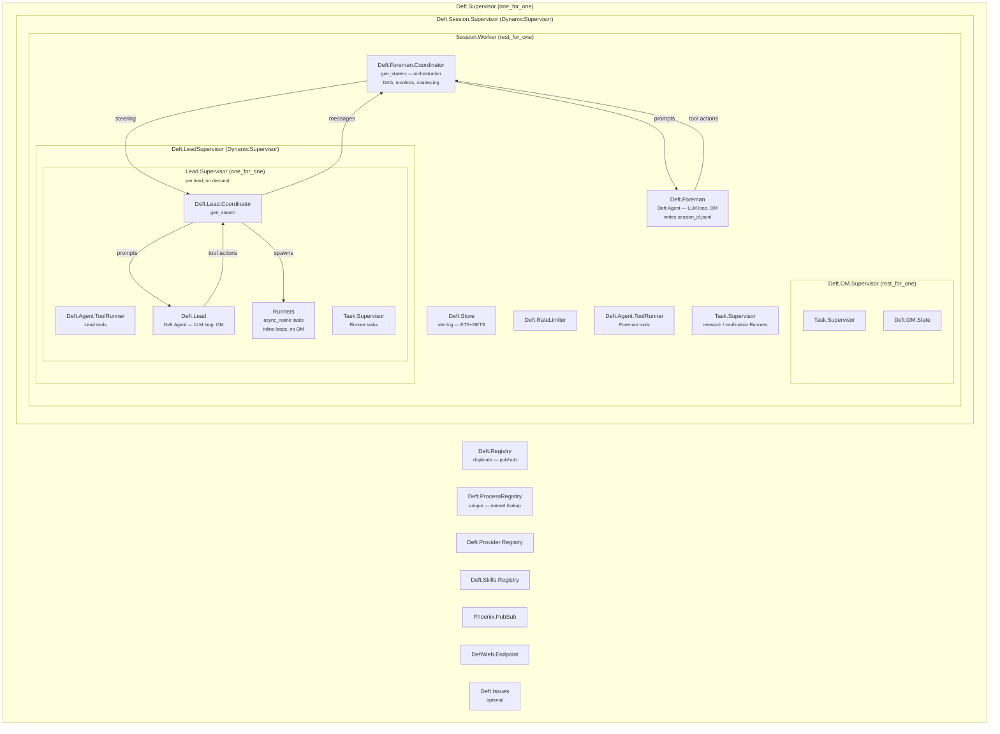

# Deft

An AI coding agent with observational memory.

## Architecture

Every session starts the same process tree. The Foreman is the agent the user talks to. For simple tasks, the Foreman handles everything directly (LeadSupervisor stays empty). For complex tasks, it spawns Leads.

